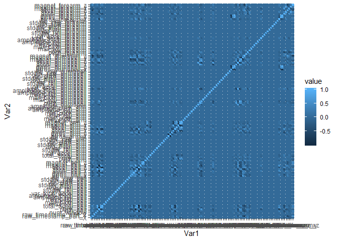
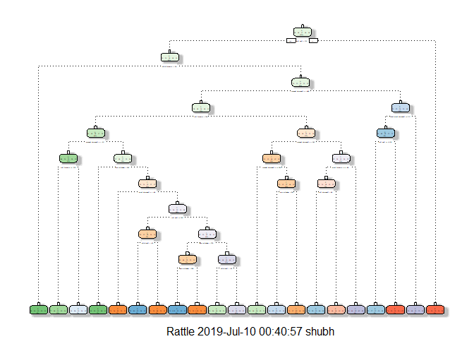

```r
knitr::opts_chunk$set(warning = FALSE, message = FALSE,echo = TRUE, cache = TRUE)
```

# Overview
Using devices such as Jawbone Up, Nike FuelBand, and Fitbit it is now possible to collect a large amount of data about personal activity relatively inexpensively. These type of devices are part of the quantified self movement - a group of enthusiasts who take measurements about themselves regularly to improve their health, to find patterns in their behavior, or because they are tech geeks. One thing that people regularly do is quantify how much of a particular activity they do, but they rarely quantify how well they do it.

In this project, we will use data from accelerometers on the belt, forearm, arm, and dumbell of 6 participants. They were asked to perform barbell lifts correctly and incorrectly in 5 different ways.

The data consists of a Training data and a Test data (to be used to validate the selected model).

The goal of your project is to predict the manner in which they did the exercise. This is the “classe” variable in the training set. You may use any of the other variables to predict with.

Note: The dataset used in this project is a courtesy of “Ugulino, W.; Cardador, D.; Vega, K.; Velloso, E.; Milidiu, R.; Fuks, H. Wearable Computing: Accelerometers’ Data Classification of Body Postures and Movements”.

More information is available from the website here: http://groupware.les.inf.puc-rio.br/har (see the section on the Weight Lifting Exercise Dataset).

## Loading libraries and setting seed.

```r
library(caret)
library(reshape2)
library(rpart)
library(rpart.plot)
library(rattle)
library(randomForest)
library(corrplot)
set.seed(12345)
```

# Getting, Cleaning and Exploring Data.
## Getting Data.
The next step is loading the dataset from the URL provided above. The training dataset is then partinioned in 2 to create a Training set (70% of the data) for the modeling process and a Test set (with the remaining 30%) for the validations. The testing dataset is not changed and will only be used for the quiz results generation.


```r
#Loading datasets.
TrainData <- read.csv("https://d396qusza40orc.cloudfront.net/predmachlearn/pml-training.csv")
TestData  <- read.csv("https://d396qusza40orc.cloudfront.net/predmachlearn/pml-testing.csv")
dim(TrainData)
```

```
## [1] 19622   160
```

```r
dim(TestData)
```

```
## [1]  20 160
```

## Creating Partition with data.

```r
inTrain  <- createDataPartition(TrainData$classe, p = 0.70, list = FALSE)
TrainSet <- TrainData[inTrain, ]
TestSet  <- TrainData[-inTrain, ]
dim(TrainSet)
```

```
## [1] 13737   160
```

```r
dim(TestSet)
```

```
## [1] 5885  160
```

Both created datasets have 160 variables. Those variables have plenty of NA, that can be removed with the cleaning procedures below. The Zero variance variables are also removed.

### Removing data with zero variance 

Since they are considered to have less predictive power. **(STACKEXCHANGE)**


```r
ZeroVariance <- nearZeroVar(TrainSet)
TrainSet <- TrainSet[, -ZeroVariance]
TestSet  <- TestSet[, -ZeroVariance]
dim(TrainSet)
```

```
## [1] 13737   104
```

```r
dim(TestSet)
```

```
## [1] 5885  104
```

## Removing Data which alters modelling.

```r
TrainSet <- TrainSet[,-(1:5)]
TestSet <- TestSet[,-(1:5)]
dim(TrainSet)
```

```
## [1] 13737    99
```

```r
dim(TestSet)
```

```
## [1] 5885   99
```

**This was very neccessary step to do because if the columns not removed all the models will lead to accuracy = 1 even in the Tree model as the variables and data are very similar and at the end doing prediction of TestData all the prediction will be "A" and no other classe.**

### Removing columns with NA values.

```r
NAS <- sapply(TrainSet, function(x) mean(is.na(x))) > 0
TrainSet <- TrainSet[, NAS == FALSE]
TestSet  <- TestSet[, NAS == FALSE]
dim(TrainSet)
```

```
## [1] 13737    54
```

```r
dim(TestSet)
```

```
## [1] 5885   54
```

### Checking data with high correlation.

A correlation among variables is analysed.


```r
Correlation <- cor(TrainData[sapply(TrainData, is.numeric)])
Correlation[is.na(Correlation)] <- 0
Cor <- findCorrelation(Correlation)
```

#### Correlated data.

```r
names(TrainSet)[Cor]
```

```
## [1] "roll_dumbbell"    "pitch_dumbbell"   "yaw_dumbbell"    
## [4] "accel_forearm_y"  NA                 "total_accel_belt"
## [7] NA
```


```r
Correlation <- melt(Correlation)
qplot(x = Var1, y = Var2, data = Correlation, fill = value, color = value)
```

<!-- -->

The Light Blue Line represents that data is collinear.

**From the graph it shows there is a correlation in variables.**

# Modelling.

Three methods will be applied to model the regressions (in the Train dataset) and the best one (with higher accuracy when applied to the Test dataset).

A Confusion Matrix is plotted at the end of each analysis to better visualize the accuracy of the models.

# The methods are:

## Tree Model

```r
ModelTree <- rpart(classe ~ ., data = TrainSet, method="class")
fancyRpartPlot(ModelTree)
```

<!-- -->

### Prediction with Tree Model

```r
PredictModelTree <- predict(ModelTree, newdata = TestSet, type = "class")
ConfMatTree <- confusionMatrix(PredictModelTree, reference = TestSet$classe)
ConfMatTree
```

```
## Confusion Matrix and Statistics
## 
##           Reference
## Prediction    A    B    C    D    E
##          A 1502  201   59   66   74
##          B   58  660   37   64  114
##          C    4   66  815  129   72
##          D   90  148   54  648  126
##          E   20   64   61   57  696
## 
## Overall Statistics
##                                           
##                Accuracy : 0.7342          
##                  95% CI : (0.7228, 0.7455)
##     No Information Rate : 0.2845          
##     P-Value [Acc > NIR] : < 2.2e-16       
##                                           
##                   Kappa : 0.6625          
##                                           
##  Mcnemar's Test P-Value : < 2.2e-16       
## 
## Statistics by Class:
## 
##                      Class: A Class: B Class: C Class: D Class: E
## Sensitivity            0.8973   0.5795   0.7943   0.6722   0.6433
## Specificity            0.9050   0.9425   0.9442   0.9151   0.9579
## Pos Pred Value         0.7897   0.7074   0.7505   0.6079   0.7751
## Neg Pred Value         0.9568   0.9033   0.9560   0.9344   0.9226
## Prevalence             0.2845   0.1935   0.1743   0.1638   0.1839
## Detection Rate         0.2552   0.1121   0.1385   0.1101   0.1183
## Detection Prevalence   0.3232   0.1585   0.1845   0.1811   0.1526
## Balanced Accuracy      0.9011   0.7610   0.8693   0.7936   0.8006
```

**Accuracy of Tree Model is 73%**

## Random Forest

```r
ControlRF <- trainControl(method="cv", number = 3)
ModelRandForest <- train(classe ~ ., data=TrainSet, method="rf",
                          trControl=ControlRF)
ModelRandForest$finalModel
```

```
## 
## Call:
##  randomForest(x = x, y = y, mtry = param$mtry) 
##                Type of random forest: classification
##                      Number of trees: 500
## No. of variables tried at each split: 27
## 
##         OOB estimate of  error rate: 0.18%
## Confusion matrix:
##      A    B    C    D    E  class.error
## A 3904    1    0    0    1 0.0005120328
## B    4 2650    3    1    0 0.0030097818
## C    0    5 2391    0    0 0.0020868114
## D    0    0    8 2244    0 0.0035523979
## E    0    0    0    2 2523 0.0007920792
```

### Prediction with Random Forest Model.

```r
PredictRandForest <- predict(ModelRandForest, newdata = TestSet)
ConfMatRandForest <- confusionMatrix(PredictRandForest, TestSet$classe)
ConfMatRandForest
```

```
## Confusion Matrix and Statistics
## 
##           Reference
## Prediction    A    B    C    D    E
##          A 1674    1    0    0    0
##          B    0 1138    2    0    0
##          C    0    0 1024    2    0
##          D    0    0    0  962    1
##          E    0    0    0    0 1081
## 
## Overall Statistics
##                                           
##                Accuracy : 0.999           
##                  95% CI : (0.9978, 0.9996)
##     No Information Rate : 0.2845          
##     P-Value [Acc > NIR] : < 2.2e-16       
##                                           
##                   Kappa : 0.9987          
##                                           
##  Mcnemar's Test P-Value : NA              
## 
## Statistics by Class:
## 
##                      Class: A Class: B Class: C Class: D Class: E
## Sensitivity            1.0000   0.9991   0.9981   0.9979   0.9991
## Specificity            0.9998   0.9996   0.9996   0.9998   1.0000
## Pos Pred Value         0.9994   0.9982   0.9981   0.9990   1.0000
## Neg Pred Value         1.0000   0.9998   0.9996   0.9996   0.9998
## Prevalence             0.2845   0.1935   0.1743   0.1638   0.1839
## Detection Rate         0.2845   0.1934   0.1740   0.1635   0.1837
## Detection Prevalence   0.2846   0.1937   0.1743   0.1636   0.1837
## Balanced Accuracy      0.9999   0.9994   0.9988   0.9989   0.9995
```

**Accuracy of Random Forest Model is 99.9%**

## GBR Model 

```r
GBR <- trainControl(method = "repeatedcv", number = 5, repeats = 1)
ModelGBM  <- train(classe ~ ., data = TrainSet, method = "gbm", trControl = GBR
                   , verbose = FALSE)
ModelGBM$finalModel
```

```
## A gradient boosted model with multinomial loss function.
## 150 iterations were performed.
## There were 53 predictors of which 53 had non-zero influence.
```

### Prediction with GBR Model

```r
PredictModelGBM <- predict(ModelGBM, newdata = TestSet)
ConfMatGBM <- confusionMatrix(PredictModelGBM, TestSet$classe)
ConfMatGBM
```

```
## Confusion Matrix and Statistics
## 
##           Reference
## Prediction    A    B    C    D    E
##          A 1673   11    0    0    0
##          B    1 1116    9    3    3
##          C    0   12 1014   20    2
##          D    0    0    3  941    5
##          E    0    0    0    0 1072
## 
## Overall Statistics
##                                           
##                Accuracy : 0.9883          
##                  95% CI : (0.9852, 0.9909)
##     No Information Rate : 0.2845          
##     P-Value [Acc > NIR] : < 2.2e-16       
##                                           
##                   Kappa : 0.9852          
##                                           
##  Mcnemar's Test P-Value : NA              
## 
## Statistics by Class:
## 
##                      Class: A Class: B Class: C Class: D Class: E
## Sensitivity            0.9994   0.9798   0.9883   0.9761   0.9908
## Specificity            0.9974   0.9966   0.9930   0.9984   1.0000
## Pos Pred Value         0.9935   0.9859   0.9676   0.9916   1.0000
## Neg Pred Value         0.9998   0.9952   0.9975   0.9953   0.9979
## Prevalence             0.2845   0.1935   0.1743   0.1638   0.1839
## Detection Rate         0.2843   0.1896   0.1723   0.1599   0.1822
## Detection Prevalence   0.2862   0.1924   0.1781   0.1613   0.1822
## Balanced Accuracy      0.9984   0.9882   0.9907   0.9873   0.9954
```

**Accuracy of GBR(Generalized Boosted Regression) Model is 98.83**

**We will use Random Forest model to predict results of the TestData because it has very high accuracy than Tree and GBR Model.**


```r
PredictTest <- predict(ModelRandForest, newdata = TestData)
PredictTest
```

```
##  [1] B A B A A E D B A A B C B A E E A B B B
## Levels: A B C D E
```
