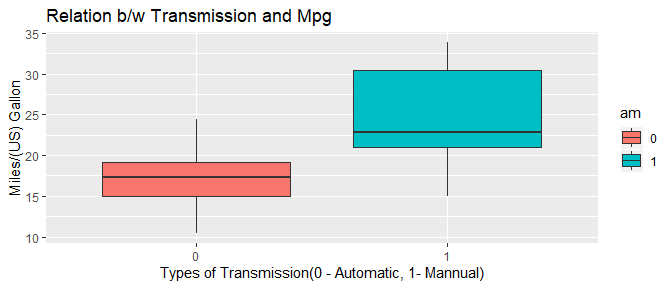
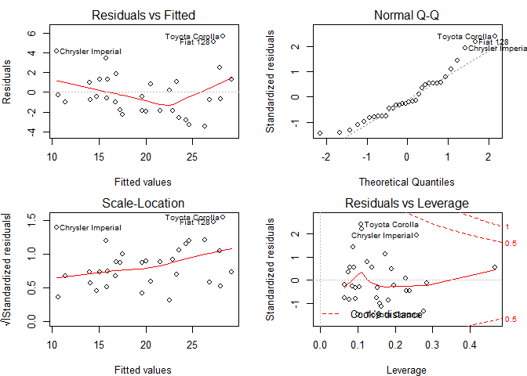
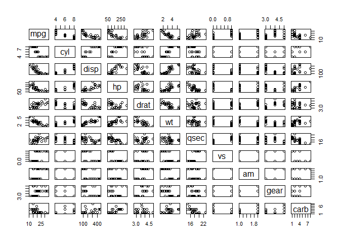

```r
knitr::opts_chunk$set(warning = FALSE, message = FALSE,echo = TRUE)
```

## Executive Summary
In this analysis we are attempting to find out whether a manual or automatic transmission is better for miles per gallon (mpg). This was done using a statistical analysis to quantify how different mpg is for cars using manual and automatic transmissions.We will use the mtcars dataset.
Manual transmission will yield better miles per gallon, when compared with Automatic. On average, a manual car will achieve **24 mpg**, versus **17 mpg** for automatic.

### Exploring the dataset

```r
#Loading Dataset mtcars.
library(ggplot2)
library(datasets)
data("mtcars")
#Summarizing data.
summary(mtcars$mpg)
```

```
##    Min. 1st Qu.  Median    Mean 3rd Qu.    Max. 
##   10.40   15.43   19.20   20.09   22.80   33.90
```

#### Making am variable a factor variable which contains transmission data.

```r
mtcars$am <- as.factor(as.numeric(mtcars$am))
```

### Boxplot to show the difference between automatic and mannual transmission.

```r
plot1 <- ggplot(data = mtcars, aes(x = am, y = mpg, fill = am)) + 
         geom_boxplot() + xlab("Types of Transmission(0 - Automatic, 1- Mannual)") +
         ylab("Miles/(US) Gallon") + ggtitle("Relation b/w Transmission and Mpg")

plot1
```

<!-- -->

The boxplot above clearly indicates that manual transmissions provide better mileage than automatic.Regression analyses will now be performed to quantify how much of a factor transmission type accounts for mileage.

## Regression
### Regression model in which mpg depends on transmission.

```r
fit <- lm(mpg ~ factor(am), mtcars)
summary(fit)
```

```
## 
## Call:
## lm(formula = mpg ~ factor(am), data = mtcars)
## 
## Residuals:
##     Min      1Q  Median      3Q     Max 
## -9.3923 -3.0923 -0.2974  3.2439  9.5077 
## 
## Coefficients:
##             Estimate Std. Error t value Pr(>|t|)    
## (Intercept)   17.147      1.125  15.247 1.13e-15 ***
## factor(am)1    7.245      1.764   4.106 0.000285 ***
## ---
## Signif. codes:  0 '***' 0.001 '**' 0.01 '*' 0.05 '.' 0.1 ' ' 1
## 
## Residual standard error: 4.902 on 30 degrees of freedom
## Multiple R-squared:  0.3598,	Adjusted R-squared:  0.3385 
## F-statistic: 16.86 on 1 and 30 DF,  p-value: 0.000285
```

The p-value is very low, so we will not reject the hypothesis. However, the R-squared value for this test is **only = .36**, suggesting that only a third or so of variance in MPG can be attributed to transmission type alone.

### Multivariable Regression Model

```r
fit2 <- lm(mpg  ~ . , mtcars)
summary(fit2)
```

```
## 
## Call:
## lm(formula = mpg ~ ., data = mtcars)
## 
## Residuals:
##     Min      1Q  Median      3Q     Max 
## -3.4506 -1.6044 -0.1196  1.2193  4.6271 
## 
## Coefficients:
##             Estimate Std. Error t value Pr(>|t|)  
## (Intercept) 12.30337   18.71788   0.657   0.5181  
## cyl         -0.11144    1.04502  -0.107   0.9161  
## disp         0.01334    0.01786   0.747   0.4635  
## hp          -0.02148    0.02177  -0.987   0.3350  
## drat         0.78711    1.63537   0.481   0.6353  
## wt          -3.71530    1.89441  -1.961   0.0633 .
## qsec         0.82104    0.73084   1.123   0.2739  
## vs           0.31776    2.10451   0.151   0.8814  
## am1          2.52023    2.05665   1.225   0.2340  
## gear         0.65541    1.49326   0.439   0.6652  
## carb        -0.19942    0.82875  -0.241   0.8122  
## ---
## Signif. codes:  0 '***' 0.001 '**' 0.01 '*' 0.05 '.' 0.1 ' ' 1
## 
## Residual standard error: 2.65 on 21 degrees of freedom
## Multiple R-squared:  0.869,	Adjusted R-squared:  0.8066 
## F-statistic: 13.93 on 10 and 21 DF,  p-value: 3.793e-07
```

From the above Analysis of Variance, we can look for p-values of less than .5. We can see cyl, wt, hp, show strong correlations and significance for the model. Hence we choose those variables plus am for a linear model. This gives us the following model below:


```r
fit3 <- lm(mpg ~ am + cyl + hp + wt, data = mtcars)
summary(fit3)
```

```
## 
## Call:
## lm(formula = mpg ~ am + cyl + hp + wt, data = mtcars)
## 
## Residuals:
##     Min      1Q  Median      3Q     Max 
## -3.4765 -1.8471 -0.5544  1.2758  5.6608 
## 
## Coefficients:
##             Estimate Std. Error t value Pr(>|t|)    
## (Intercept) 36.14654    3.10478  11.642 4.94e-12 ***
## am1          1.47805    1.44115   1.026   0.3142    
## cyl         -0.74516    0.58279  -1.279   0.2119    
## hp          -0.02495    0.01365  -1.828   0.0786 .  
## wt          -2.60648    0.91984  -2.834   0.0086 ** 
## ---
## Signif. codes:  0 '***' 0.001 '**' 0.01 '*' 0.05 '.' 0.1 ' ' 1
## 
## Residual standard error: 2.509 on 27 degrees of freedom
## Multiple R-squared:  0.849,	Adjusted R-squared:  0.8267 
## F-statistic: 37.96 on 4 and 27 DF,  p-value: 1.025e-10
```

This Multivariable Regression test now gives us an R-squared value of over **.8**, suggesting that **85%** or more of variance can be explained by the multivariable model. P-values for cyl (number of cylinders) and weight are below 0.5, suggesting that these are confounding variables in the relation between car Transmission Type and Miles per Gallon. 
This model provided the following results: a **1.48MPG** increase from manual transmissions over automatic ones with the multivariable model explaining **85%** of the MPG performance.

## Appendix


```r
par(mar = c(4,4,2,2), mfrow = c(2,2))
plot(fit3)
```

<!-- -->


```r
par(mar = c(1,1,1,1))
pairs(mpg ~., mtcars)
```

<!-- -->
