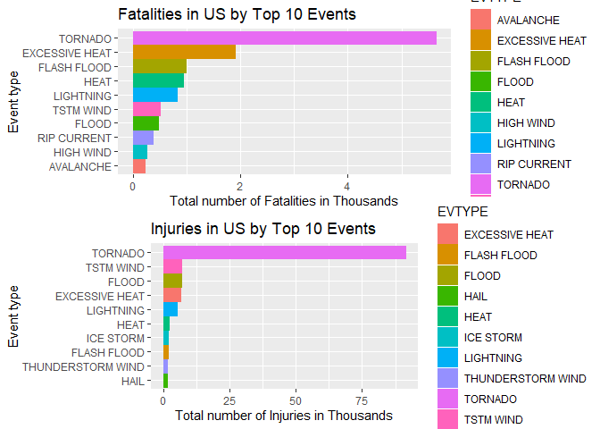
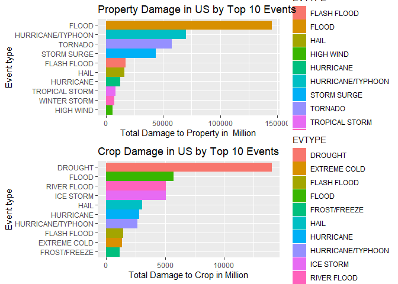

```r
knitr::opts_chunk$set(warning = FALSE, message = FALSE,echo = TRUE)
```

## 1: Synopsis
The goal of the assignment is to explore the NOAA Storm Database and explore the effects of severe weather events on both population and economy.The database covers the time period between 1950 and November 2011.

The following analysis investigates which types of severe weather events are most harmful on:

1. Health (injuries and fatalities) 
2. Property and crops (economic consequences)

Information on the Data: [Documentation](https://d396qusza40orc.cloudfront.net/repdata%2Fpeer2_doc%2Fpd01016005curr.pdf)

## 2: Data Processing

### 2.1: Data Loading

Loading Required packages and downloading the raw data file from the url and reading data directly to form data.table.
It requires R.utils package to extract bz2 files and to read files from it.

```r
library(data.table)
library(ggplot2)
library(gridExtra)
library(grid)
library(R.utils)

path <- getwd()
url <- "https://d396qusza40orc.cloudfront.net/repdata%2Fdata%2FStormData.csv.bz2"
stormdata <- data.table::fread(url)
```

### 2.2: Examining Column Names


```r
#Column names  and some values of the table.
names(stormdata)
```

```
##  [1] "STATE__"    "BGN_DATE"   "BGN_TIME"   "TIME_ZONE"  "COUNTY"    
##  [6] "COUNTYNAME" "STATE"      "EVTYPE"     "BGN_RANGE"  "BGN_AZI"   
## [11] "BGN_LOCATI" "END_DATE"   "END_TIME"   "COUNTY_END" "COUNTYENDN"
## [16] "END_RANGE"  "END_AZI"    "END_LOCATI" "LENGTH"     "WIDTH"     
## [21] "F"          "MAG"        "FATALITIES" "INJURIES"   "PROPDMG"   
## [26] "PROPDMGEXP" "CROPDMG"    "CROPDMGEXP" "WFO"        "STATEOFFIC"
## [31] "ZONENAMES"  "LATITUDE"   "LONGITUDE"  "LATITUDE_E" "LONGITUDE_"
## [36] "REMARKS"    "REFNUM"
```

```r
head(stormdata)
```

```
##    STATE__           BGN_DATE BGN_TIME TIME_ZONE COUNTY COUNTYNAME STATE
## 1:       1  4/18/1950 0:00:00     0130       CST     97     MOBILE    AL
## 2:       1  4/18/1950 0:00:00     0145       CST      3    BALDWIN    AL
## 3:       1  2/20/1951 0:00:00     1600       CST     57    FAYETTE    AL
## 4:       1   6/8/1951 0:00:00     0900       CST     89    MADISON    AL
## 5:       1 11/15/1951 0:00:00     1500       CST     43    CULLMAN    AL
## 6:       1 11/15/1951 0:00:00     2000       CST     77 LAUDERDALE    AL
##     EVTYPE BGN_RANGE BGN_AZI BGN_LOCATI END_DATE END_TIME COUNTY_END
## 1: TORNADO         0                                               0
## 2: TORNADO         0                                               0
## 3: TORNADO         0                                               0
## 4: TORNADO         0                                               0
## 5: TORNADO         0                                               0
## 6: TORNADO         0                                               0
##    COUNTYENDN END_RANGE END_AZI END_LOCATI LENGTH WIDTH F MAG FATALITIES
## 1:         NA         0                      14.0   100 3   0          0
## 2:         NA         0                       2.0   150 2   0          0
## 3:         NA         0                       0.1   123 2   0          0
## 4:         NA         0                       0.0   100 2   0          0
## 5:         NA         0                       0.0   150 2   0          0
## 6:         NA         0                       1.5   177 2   0          0
##    INJURIES PROPDMG PROPDMGEXP CROPDMG CROPDMGEXP WFO STATEOFFIC ZONENAMES
## 1:       15    25.0          K       0                                    
## 2:        0     2.5          K       0                                    
## 3:        2    25.0          K       0                                    
## 4:        2     2.5          K       0                                    
## 5:        2     2.5          K       0                                    
## 6:        6     2.5          K       0                                    
##    LATITUDE LONGITUDE LATITUDE_E LONGITUDE_ REMARKS REFNUM
## 1:     3040      8812       3051       8806              1
## 2:     3042      8755          0          0              2
## 3:     3340      8742          0          0              3
## 4:     3458      8626          0          0              4
## 5:     3412      8642          0          0              5
## 6:     3450      8748          0          0              6
```

### 2.3: Data Selection

Extracting only Neccessary Columns and Data.

```r
stormdata <- stormdata[,c("EVTYPE", "FATALITIES", "INJURIES", "PROPDMG",   "PROPDMGEXP", "CROPDMG", "CROPDMGEXP")]
```

### 2.4: Converting Exponent Columns into Actual Exponents instead of (-,+, H, K, etc)

Making the PROPDMGEXP and CROPDMGEXP columns cleaner so they can be used to calculate Property and Crop cost and the values can be user readble.


```r
#Checking for distint values.
unique(stormdata$PROPDMGEXP)
```

```
##  [1] "K" "M" ""  "B" "m" "+" "0" "5" "6" "?" "4" "2" "3" "h" "7" "H" "-"
## [18] "1" "8"
```

```r
unique(stormdata$CROPDMGEXP)
```

```
## [1] ""  "M" "K" "m" "B" "?" "0" "k" "2"
```

```r
#Changing the values to user readable values. 
stormdata$PROPDMGEXP[stormdata$PROPDMGEXP == "K"] <- 1000
stormdata$PROPDMGEXP[stormdata$PROPDMGEXP == "M"] <- 1e+06
stormdata$PROPDMGEXP[stormdata$PROPDMGEXP == ""] <- 1
stormdata$PROPDMGEXP[stormdata$PROPDMGEXP == "B"] <- 1e+09
stormdata$PROPDMGEXP[stormdata$PROPDMGEXP == "m"] <- 1e+06
stormdata$PROPDMGEXP[stormdata$PROPDMGEXP == "0"] <- 1
stormdata$PROPDMGEXP[stormdata$PROPDMGEXP == "5"] <- 1e+05
stormdata$PROPDMGEXP[stormdata$PROPDMGEXP == "6"] <- 1e+06
stormdata$PROPDMGEXP[stormdata$PROPDMGEXP == "4"] <- 10000
stormdata$PROPDMGEXP[stormdata$PROPDMGEXP == "2"] <- 100
stormdata$PROPDMGEXP[stormdata$PROPDMGEXP == "3"] <- 1000
stormdata$PROPDMGEXP[stormdata$PROPDMGEXP == "h"] <- 100
stormdata$PROPDMGEXP[stormdata$PROPDMGEXP == "7"] <- 1e+07
stormdata$PROPDMGEXP[stormdata$PROPDMGEXP == "H"] <- 100
stormdata$PROPDMGEXP[stormdata$PROPDMGEXP == "1"] <- 10
stormdata$PROPDMGEXP[stormdata$PROPDMGEXP == "8"] <- 1e+08

# Assigning '0' to invalid exponent stormdata
stormdata$PROPDMGEXP[stormdata$PROPDMGEXP == "+"] <- 0
stormdata$PROPDMGEXP[stormdata$PROPDMGEXP == "-"] <- 0
stormdata$PROPDMGEXP[stormdata$PROPDMGEXP == "?"] <- 0

#Changing class of PROPDMGEXP to numeric.
stormdata$PROPDMGEXP <- as.numeric(stormdata$PROPDMGEXP)

# Assigning values for the crop exponent stormdata 
stormdata$CROPDMGEXP[stormdata$CROPDMGEXP == "M"] <- 1e+06
stormdata$CROPDMGEXP[stormdata$CROPDMGEXP == "K"] <- 1000
stormdata$CROPDMGEXP[stormdata$CROPDMGEXP == "m"] <- 1e+06
stormdata$CROPDMGEXP[stormdata$CROPDMGEXP == "B"] <- 1e+09
stormdata$CROPDMGEXP[stormdata$CROPDMGEXP == "0"] <- 1
stormdata$CROPDMGEXP[stormdata$CROPDMGEXP == "k"] <- 1000
stormdata$CROPDMGEXP[stormdata$CROPDMGEXP == "2"] <- 100
stormdata$CROPDMGEXP[stormdata$CROPDMGEXP == ""] <- 1

# Assigning '0' to invalid exponent stormdata
stormdata$CROPDMGEXP[stormdata$CROPDMGEXP == "?"] <- 0

#Changing class of CROPDMGEXP to numeric.
stormdata$CROPDMGEXP <- as.numeric(stormdata$CROPDMGEXP)
```

### 2.5: Calcuating Total Property and Crop  Damage Cost.


```r
# Calculating the property damage value
stormdata$PROPDMGVAL <- stormdata$PROPDMG * stormdata$PROPDMGEXP

# calculating the crop damage value
stormdata$CROPDMGVAL <- stormdata$CROPDMG * stormdata$CROPDMGEXP
```

### 2.6:Calculating total numbers by events and selecting data with values greater than 0.


```r
FatalitiesData <- aggregate(FATALITIES ~ EVTYPE, stormdata, FUN = sum, na.rm = TRUE)
FatalitiesData <- FatalitiesData[FatalitiesData$FATALITIES > 0,]

InjuriesData <- aggregate(INJURIES ~ EVTYPE, stormdata, FUN = sum, na.rm = TRUE)
InjuriesData <- InjuriesData[InjuriesData$INJURIES > 0,]

PropDmgValueData <- aggregate(PROPDMGVAL ~ EVTYPE, stormdata, FUN = sum, na.rm = TRUE)
PropDmgValueData <- PropDmgValueData[PropDmgValueData$PROPDMGVAL > 0,]

CropDmgValueData <- aggregate(CROPDMGVAL ~ EVTYPE, stormdata, FUN = sum, na.rm = TRUE)
CropDmgValueData <- CropDmgValueData[CropDmgValueData$CROPDMGVAL > 0,]
```

### 2.7: Ordering Data with Highest Values


```r
#Ordering events with highest fatalities.
FatalitiesData <- FatalitiesData[order(-FatalitiesData$FATALITIES), ]

#Ordering events with highest injuries.
InjuriesData <- InjuriesData[order(-InjuriesData$INJURIES), ]

#Ordering events with highest Property Damage.
PropDmgValueData <- PropDmgValueData[order(-PropDmgValueData$PROPDMGVAL), ]

#Ordering events with highest injuries.
CropDmgValueData <- CropDmgValueData[order(-CropDmgValueData$CROPDMGVAL), ]
```

## 3: Results

### 3.1: Events with Highest Fatalities and Injuries.


```r
head(FatalitiesData)
```

```
##             EVTYPE FATALITIES
## 834        TORNADO       5633
## 130 EXCESSIVE HEAT       1903
## 153    FLASH FLOOD        978
## 275           HEAT        937
## 464      LIGHTNING        816
## 856      TSTM WIND        504
```

```r
head(InjuriesData)
```

```
##             EVTYPE INJURIES
## 834        TORNADO    91346
## 856      TSTM WIND     6957
## 170          FLOOD     6789
## 130 EXCESSIVE HEAT     6525
## 464      LIGHTNING     5230
## 275           HEAT     2100
```

### 3.2: Events with Highest Property Damage and Crop Damage.


```r
head(PropDmgValueData)
```

```
##                EVTYPE   PROPDMGVAL
## 170             FLOOD 144657709870
## 411 HURRICANE/TYPHOON  69305840000
## 834           TORNADO  56947381845
## 670       STORM SURGE  43323536000
## 153       FLASH FLOOD  16822678195
## 244              HAIL  15735270147
```

```r
head(CropDmgValueData)
```

```
##          EVTYPE  CROPDMGVAL
## 95      DROUGHT 13972566000
## 170       FLOOD  5661968450
## 590 RIVER FLOOD  5029459000
## 427   ICE STORM  5022113500
## 244        HAIL  3025954473
## 402   HURRICANE  2741910000
```

### 3.3: Graph of Events with Highest Fatalitites and Injuries.


```r
plot1 <- ggplot(data = FatalitiesData[1:10,], aes(x = reorder(EVTYPE,                  FATALITIES), y = FATALITIES/1000, color = EVTYPE, fill = EVTYPE)) +
         geom_bar(stat = "identity")  + coord_flip() + 
         ylab("Total number of Fatalities in Thousands") + xlab("Event type")          + ggtitle("Fatalities in US by Top 10 Events")

#Plotting events with highest Injuries
plot2 <- ggplot(data = InjuriesData[1:10,], aes(x = reorder(EVTYPE, INJURIES),          y = INJURIES/1000, color = EVTYPE, fill = EVTYPE)) +
         geom_bar(stat = "identity") + coord_flip() +
         ylab("Total number of Injuries in Thousands") + xlab("Event type") +
         ggtitle("Injuries in US by Top 10 Events")

#Combining them to make 1 Plot
grid.arrange(plot1, plot2, nrow =2)
```

<!-- -->

### 3.4: Graph of Events with Highest Property and Crop Damage.


```r
#Plotting events with highest Property Damage.
plot3 <- ggplot(data = PropDmgValueData[1:10,], aes(x = reorder(EVTYPE, PROPDMGVAL),y = PROPDMGVAL/1000000, color = EVTYPE, fill = EVTYPE)) + geom_bar(stat = "identity")  + coord_flip() + ylab("Total Damage to Property in  Million") + xlab("Event type") + ggtitle("Property Damage in US by Top 10 Events")

#Plotting events with highest Crop Damage.
plot4 <- ggplot(data = CropDmgValueData[1:10,], aes(x = reorder(EVTYPE, CROPDMGVAL), y = CROPDMGVAL/1000000, color = EVTYPE, fill = EVTYPE)) + geom_bar(stat = "identity")  + coord_flip() + ylab("Total Damage to Crop in Million") + xlab("Event type") + ggtitle("Crop Damage in US by Top 10 Events")

#Combining them to make 1 plot.
grid.arrange(plot3, plot4, nrow =2)
```

<!-- -->
