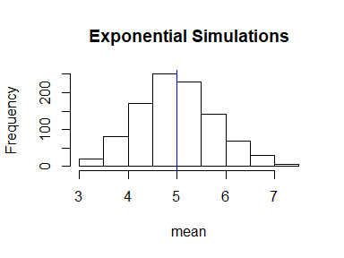
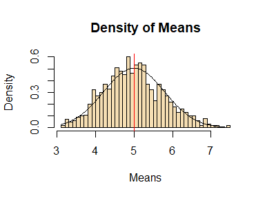

```r
knitr::opts_chunk$set(warning = FALSE, message = FALSE,echo = TRUE)
```

We will investigate the distribution of averages of 40 exponentials. Note that We have to do a thousand simulations.

### Setting Seed and Initializing Values and Creating 1000 simulations with 40 exponential values.

```r
set.seed(1)
lambda <- 0.2
n <- 40
simulations <- 1000
Exponentials <- replicate(simulations, rexp(n, rate = lambda))
```

### Calculating mean of 1000 Samples with 40 Exponentials

```r
ExponentialsMean <- apply(Exponentials, 2, mean)
```

### 1. Show the sample mean and compare it to the theoretical mean of the distribution.

### Analytical Mean and Theoritical Mean of the data.

```r
AnalyticalMean <- mean(ExponentialsMean)
AnalyticalMean
```

```
## [1] 4.990025
```

```r
TheoryMean <- 1/lambda
TheoryMean
```

```
## [1] 5
```
From the results we can see that mean of our simulated distribution is **4.990025**  which is very close to the theoretical mean 1/lambda = **5**

### 2. Show how variable the sample is and compare it to the theoretical variance of the distribution.

### Standard Deviation and Variance of the dsitribution.

```r
StandardDeviation <- sd(ExponentialsMean)
StandardDeviation
```

```
## [1] 0.7817394
```

```r
Variance <- StandardDeviation^2
Variance
```

```
## [1] 0.6111165
```

### Theoritical Standard deviation and Variance. 

```r
TheoryStandardDeviation <- (1/lambda)/sqrt(n)
TheoryStandardDeviation
```

```
## [1] 0.7905694
```

```r
TheoryVariance <- ((1/lambda)*(1/sqrt(n)))^2
TheoryVariance
```

```
## [1] 0.625
```

As we can see they're very close, **0.6111165** and **0.625**, respectively.

### Histogram of Means with Theoritical and Analytical abline.

```r
hist(ExponentialsMean, xlab = "mean", main = "Exponential Simulations")
abline(v = AnalyticalMean, col = "red")
abline(v = TheoryMean, col = "blue")
```

<!-- -->

Here we can see purple line because the ablines of theoritical mean and analytical mean coincides with each other as they are very close.

### 3. Show that the distribution is approximately normal.

### Plot to show distribution is normal.

```r
X <- seq(min(ExponentialsMean), max(ExponentialsMean), length.out = 200)
Y <- dnorm(X, mean = TheoryMean, sd = TheoryStandardDeviation)
hist(ExponentialsMean, breaks = n, prob = TRUE, col = "wheat", xlab = "Means", 
     main="Density of Means", ylab="Density")
lines(X, Y, col="black", lty=1)
abline(v = TheoryMean, col = "red")
```

<!-- -->

### Confidence intervals by Analysis

```r
TheoryCI<- TheoryMean + c(-1,1) * 1.96 * TheoryStandardDeviation/sqrt(n)
TheoryCI
```

```
## [1] 4.755 5.245
```
### Actual Confidence intervals

```r
ActualCI<- AnalyticalMean + c(-1,1) * 1.96 * StandardDeviation/sqrt(n)
ActualCI
```

```
## [1] 4.747762 5.232289
```
From the plot we see that the normalized distribution of sample means is approximately the same as the standard normal distribution as we can see comparing it to the density function, the black bell-shaped curve. 
As confidence interval of distribution is **(4.755 , 5.245)** and the actual confidence interval is **(4.747762 , 5.232289)**.This is consistent with what is stated in the Central Limit Theorem.
