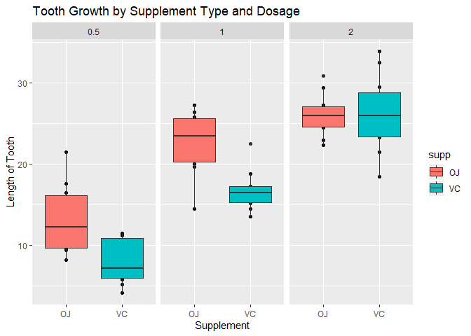

```r
knitr::opts_chunk$set(warning = FALSE, message = FALSE,echo = TRUE)
```

### 1. Load the ToothGrowth data and perform some basic exploratory data analyses.

#### Loading Libraries and dataset

```r
library(ggplot2)
library(datasets)
data("ToothGrowth")
```

### 2. Provide a basic summary of the data.

```r
dim(ToothGrowth)
```

```
## [1] 60  3
```

```r
summary(ToothGrowth)
```

```
##       len        supp         dose      
##  Min.   : 4.20   OJ:30   Min.   :0.500  
##  1st Qu.:13.07   VC:30   1st Qu.:0.500  
##  Median :19.25           Median :1.000  
##  Mean   :18.81           Mean   :1.167  
##  3rd Qu.:25.27           3rd Qu.:2.000  
##  Max.   :33.90           Max.   :2.000
```

```r
unique(ToothGrowth$dose)
```

```
## [1] 0.5 1.0 2.0
```

#### Making Boxplot of the Toothdata.

```r
qplot(x = supp, y = len, data = ToothGrowth, facets = ~ dose, 
      main = "Tooth Growth by Supplement Type and Dosage", xlab="Supplement",
      ylab = "Length of Tooth") + geom_boxplot(aes(fill = supp))
```

<!-- -->

**According to the plot there is a statistically significant difference between teeth length and dose levels across both delivery methods, as the dose increases so does length.**

#### Subsetting data according to Doses.

```r
Dose0.5 <- subset.data.frame(x = ToothGrowth, dose == 0.5) 
Dose1.0 <- subset.data.frame(x = ToothGrowth, dose == 1.0) 
Dose2.0 <- subset.data.frame(x = ToothGrowth, dose == 2.0)
```

### 3. Use confidence intervals and/or hypothesis tests to compare tooth growth by supp and dose.

#### T.test on the data with 0.5 Dose

```r
T.TestDose0.5 <- t.test(len ~ supp, data = Dose0.5)
T.TestDose0.5
```

```
## 
## 	Welch Two Sample t-test
## 
## data:  len by supp
## t = 3.1697, df = 14.969, p-value = 0.006359
## alternative hypothesis: true difference in means is not equal to 0
## 95 percent confidence interval:
##  1.719057 8.780943
## sample estimates:
## mean in group OJ mean in group VC 
##            13.23             7.98
```
**p-value** when dosage is 0.5 is **0.006359** < 0.05.

#### T.test on the data with 1.0 Dose

```r
T.TestDose1.0 <- t.test(len ~ supp, data = Dose1.0)
T.TestDose1.0
```

```
## 
## 	Welch Two Sample t-test
## 
## data:  len by supp
## t = 4.0328, df = 15.358, p-value = 0.001038
## alternative hypothesis: true difference in means is not equal to 0
## 95 percent confidence interval:
##  2.802148 9.057852
## sample estimates:
## mean in group OJ mean in group VC 
##            22.70            16.77
```
**p-value** when dosage is 1.0 is **0.001038** < 0.05.

#### T.test on the data with 2.0 Dose

```r
T.TestDose2.0 <- t.test(len ~ supp, data = Dose2.0)
T.TestDose2.0
```

```
## 
## 	Welch Two Sample t-test
## 
## data:  len by supp
## t = -0.046136, df = 14.04, p-value = 0.9639
## alternative hypothesis: true difference in means is not equal to 0
## 95 percent confidence interval:
##  -3.79807  3.63807
## sample estimates:
## mean in group OJ mean in group VC 
##            26.06            26.14
```
**p-value** when dosage is 2.0 is **0.9639** > 0.05.

#### T.test on the ToothGrowth Data when length depends on supplement. 

```r
T.TestToothGrowth <- t.test(len ~ supp, data = ToothGrowth)
T.TestToothGrowth
```

```
## 
## 	Welch Two Sample t-test
## 
## data:  len by supp
## t = 1.9153, df = 55.309, p-value = 0.06063
## alternative hypothesis: true difference in means is not equal to 0
## 95 percent confidence interval:
##  -0.1710156  7.5710156
## sample estimates:
## mean in group OJ mean in group VC 
##         20.66333         16.96333
```
**p-value** when length depends on supplement is **0.06063** > 0.05.

### 4. State your conclusions and the assumptions needed for your conclusions.

In the previous section of this report we drew some conclusions from our tests.
**It appears that there is a significant relationship between teeth length and dose levels across both delivery methods, as the dose increases so does length. On the other hand, there doesn't seem to be a statistically significant difference between delivery methods, with OJ apparently more effective at dose levels 0.5 and 1, and VC slightly more effective at dose level 2**
